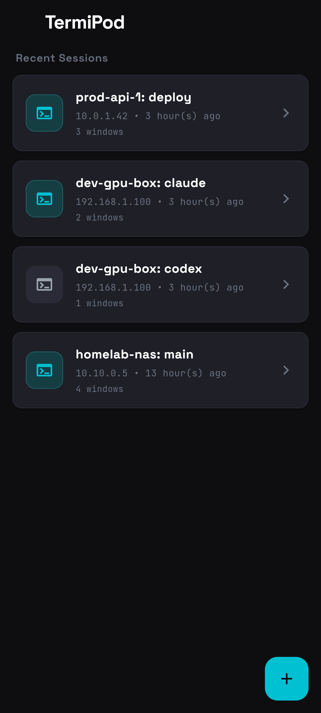
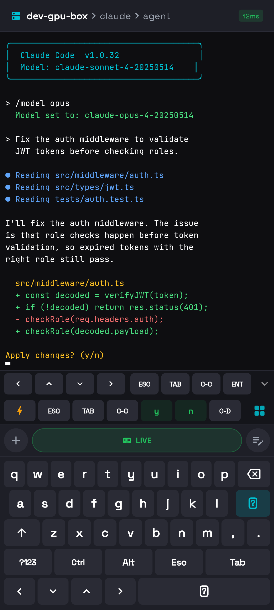
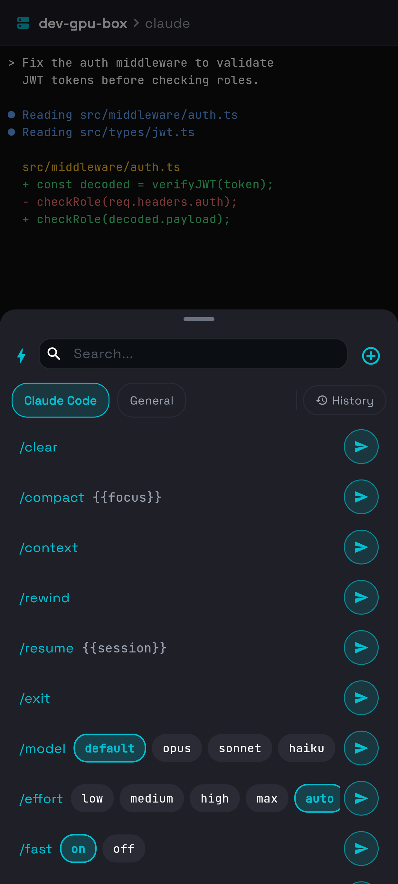
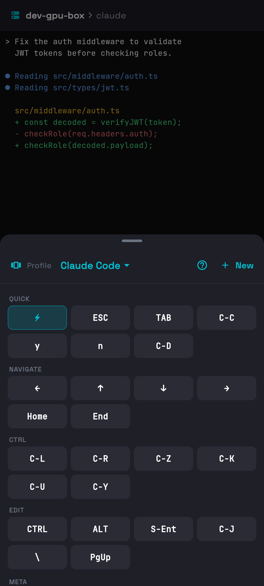
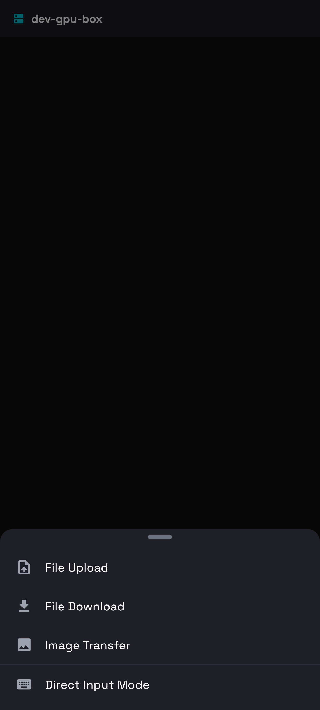
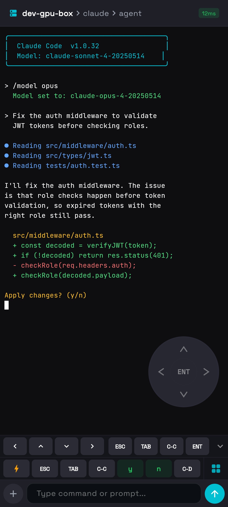
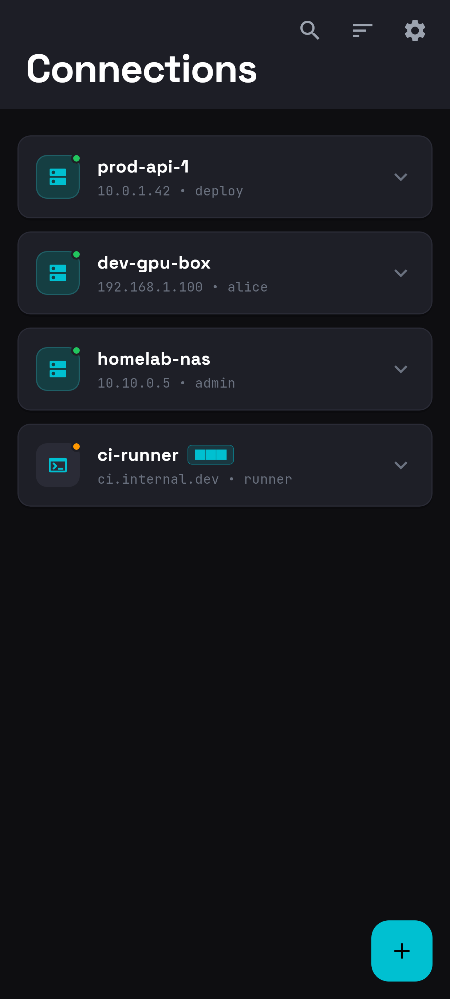
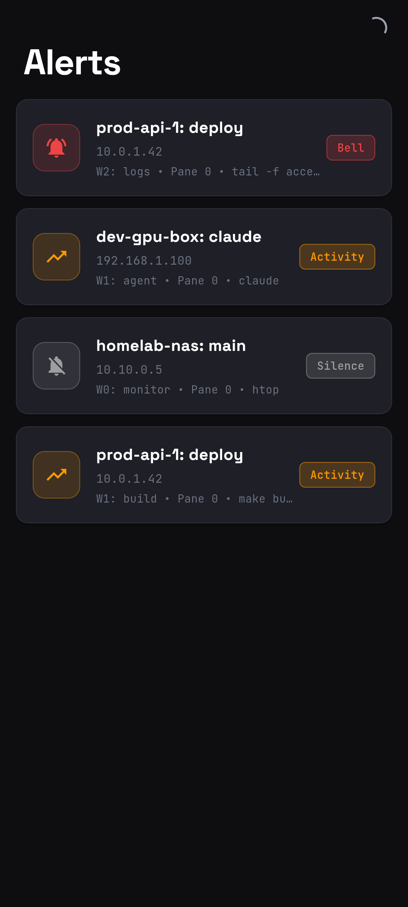
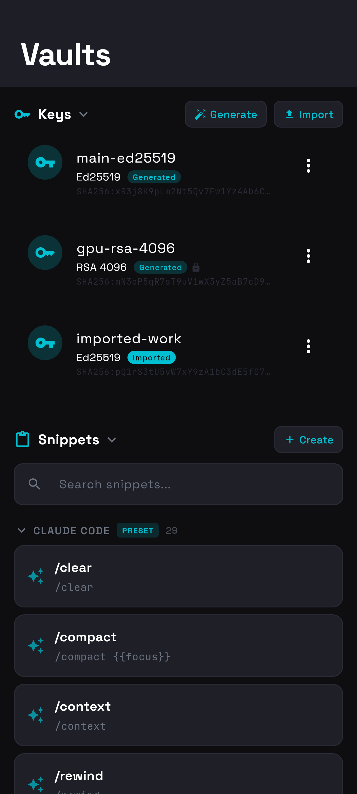

<p align="center">
  
</p>

<h1 align="center">TermiPod</h1>

<p align="center">
  <b>モバイル SSH ターミナル — tmux と AI コーディングエージェント対応。</b><br>
  <sub>スマートフォンやタブレットからリモートサーバーを管理。Claude Code、Codex などの CLI ツールを、タッチ最適化されたターミナルで実行。<br>Android、iOS、iPadOS — 単一の Flutter コードベース。</sub>
</p>

<p align="center">
  <a href="https://github.com/physercoe/termipod/releases"></a>
  <a href="LICENSE"></a>
  
  
  
  
</p>

<p align="center">
  <a href="README.md">English</a> &nbsp;|&nbsp;
  <a href="README.zh.md">中文</a>
</p>

---

## スクリーンショット

<table>
<tr>
<td align="center"><b>ダッシュボード</b></td>
<td align="center"><b>ターミナル + カスタムキーボード</b></td>
<td align="center"><b>エージェントコマンド</b></td>
</tr>
<tr>
<td></td>
<td></td>
<td></td>
</tr>
<tr>
<td align="center"><b>キーパレット</b></td>
<td align="center"><b>挿入メニュー</b></td>
<td align="center"><b>ターミナル</b></td>
</tr>
<tr>
<td></td>
<td></td>
<td></td>
</tr>
<tr>
<td align="center"><b>サーバー</b></td>
<td align="center"><b>アラート</b></td>
<td align="center"><b>Vault（鍵・スニペット）</b></td>
</tr>
<tr>
<td></td>
<td></td>
<td></td>
</tr>
</table>

---

## TermiPod とは？

一般的な SSH アプリが生のターミナルと小さなキーボードを提供するだけなのに対し、TermiPod はモバイルでのターミナル利用の実態に合わせて設計されています：

- **tmux セッションの視覚的ナビゲーション** — セッション、ウィンドウ、ペインをタップで切り替え
- **AI コーディングエージェントの実行**（Claude Code、Codex、Aider）— 事前設定されたボタンレイアウトと構造化スラッシュコマンド
- **ペイン毎のプロファイル** — 各 tmux ペインが独自のアクションバーレイアウトを記憶
- **カスタムキーボード** — Ctrl/Alt/Esc/矢印を組み込んだ Flutter ネイティブ QWERTY
- **ファイル転送** — SFTP でサーバーとファイルのアップロード・ダウンロード
- **踏み台サーバー/プロキシ対応** — SSH ProxyJump と SOCKS5 プロキシ

### 対象ユーザー

| | |
|---|---|
| **AI エージェントユーザー** | tmux で Claude Code / Codex を実行、スマホから監視・操作 |
| **開発者** | 開発マシン、CI サーバー、クラウド VM に SSH 接続 |
| **DevOps/SRE** | 外出中にサービスの確認、ログ確認、プロセス再起動 |
| **ホームラボ愛好者** | スマホからサーバー、Raspberry Pi、NAS を管理 |

---

## 機能

### SSH・接続
- **Ed25519/RSA 鍵** — デバイス上で生成またはインポート、Android Keystore / iOS Keychain に暗号化保存
- **SSH ProxyJump（踏み台サーバー）** — 踏み台経由で内部ネットワークのマシンに接続
- **SOCKS5 プロキシ** — 企業プロキシ、VPN、Shadowsocks/Clash 経由で SSH 接続
- **Raw PTY モード** — tmux なしのサーバーに直接シェルアクセス
- **接続テスト** — 保存前に SSH + tmux の可用性を確認

### tmux セッション管理
- **視覚的ナビゲーション** — ブレッドクラムヘッダーでセッション/ウィンドウ/ペインを切り替え
- **ペインレイアウト表示** — 分割ペインの正確な比率表示
- **2本指スワイプ** — tmux 分割ペイン間のナビゲーション
- **セッション・ウィンドウの作成/名前変更/閉じる**
- **256 色 ANSI** ターミナルレンダリング + 自動スクロールバック拡張

### 入力 UX（モバイル最適化）

| コンポーネント | 機能 |
|-------------|------|
| **アクションバー** | プロファイル毎のスワイプ可能なボタングループ — ESC、Tab、Ctrl+C がワンタップ |
| **コンポーズバー** | 送信ボタン付き複数行テキスト入力。長押し送信で Enter 省略 |
| **カスタムキーボード** | Ctrl/Alt/Esc/矢印付き Flutter ネイティブ QWERTY。CJK 入力時はオフ |
| **ナビゲーションパッド** | D-pad、ジョイスティック、ジェスチャーサーフェス |
| **スニペット** | 列挙型はドロップダウン、自由入力はテキストフィールドのスラッシュコマンド |
| **修飾キー** | Ctrl/Alt — タップでアーム、ダブルタップでロック |

**4つの内蔵プロファイル** — Claude Code、Codex、汎用ターミナル、tmux。カスタムプロファイルも作成可能。

### ファイル転送
- **SFTP アップロード/ダウンロード** — 進捗表示、リモートディレクトリ閲覧
- **画像転送** — フォーマット変換、リサイズ、パス注入対応

### その他
- **データエクスポート/インポート** — 接続・鍵・スニペット・履歴・設定をJSON形式でバックアップ、別デバイスへの復元や旧MuxPodアプリからの移行に対応

---

## 同類アプリとの比較

| 機能 | TermiPod | Termux | JuiceSSH | Termius | ConnectBot |
|------|----------|--------|----------|---------|------------|
| **プラットフォーム** | Android + iOS + iPad | Android | Android | マルチ | Android |
| **tmux 統合** | ネイティブ（視覚的） | 手動（CLI） | なし | なし | なし |
| **AI エージェント対応** | Claude Code + Codex、ペイン毎の状態 | なし | なし | なし | なし |
| **SSH 踏み台サーバー** | 内蔵 | CLI 経由 | CLI 経由 | 内蔵 | なし |
| **SOCKS5 プロキシ** | 内蔵 | CLI 経由 | なし | なし | なし |
| **ファイル転送** | SFTP（UI 付き） | ローカル FS | なし | SFTP | なし |
| **オープンソース** | はい (Apache 2.0) | はい | いいえ | いいえ | はい |

---

## クイックスタート

### インストール

**Android:** [**Releases**](https://github.com/physercoe/termipod/releases) から最新の APK をダウンロードしてインストール。

**iOS / iPadOS:** Xcode でソースからビルドしてください。TestFlight 配布はロードマップ上にあります。

### ソースからビルド

```bash
git clone https://github.com/physercoe/termipod.git
cd termipod
flutter pub get

# Android
flutter build apk --release

# iOS / iPadOS（macOS + Xcode が必要）
flutter build ios --release
```

### 接続

1. **サーバーを追加** — サーバータブで + をタップ、ホスト/ポート/ユーザー名を入力
2. **認証** — パスワードまたは SSH 鍵を選択（Vault > Keys で生成可能）
3. **オプション** — 接続フォームでジャンプホストまたは SOCKS5 プロキシを設定
4. **ナビゲーション** — サーバー展開 > セッション > ウィンドウ > ペイン
5. **操作** — アクションバーでクイックキー、コンポーズバーでコマンド、[+] でスニペットとファイル転送

---

## 必要要件

| コンポーネント | 要件 |
|----------------|------|
| **デバイス** | Android 8.0+(API 26)、iOS 13.0+、iPadOS 13.0+ |
| **サーバー** | 任意の SSH サーバー（OpenSSH、Dropbear 等） |
| **tmux** | 任意のバージョン（2.9+ で動作確認）— Raw PTY モードでは不要 |
| **ネットワーク** | 直接 SSH、または踏み台サーバー / SOCKS5 プロキシ経由 |

---

## ロードマップ

- ハイブリッド xterm モード — PTY ストリーム描画と tmux セッションナビゲーションの統合
- ローカルエコー — 低遅延接続のための予測文字表示
- カーソル整列 — フォントグリフ幅キャリブレーション
- iOS TestFlight / App Store 配布

---

## 謝辞

TermiPod は [@moezakura](https://github.com/moezakura) による [MuxPod](https://github.com/moezakura/mux-pod)（Copyright 2025 mox、[Apache License 2.0](LICENSE)）をベースに開発されています。TermiPod は独立プロジェクトであり、原作者とは提携・推奨関係にありません。詳細は [NOTICE](NOTICE) を参照してください。

## ライセンス

[Apache License 2.0](LICENSE)

---

<p align="center">
  <sub>Flutter で構築。モバイルのために設計。ターミナルに生きる開発者のために。</sub>
</p>
