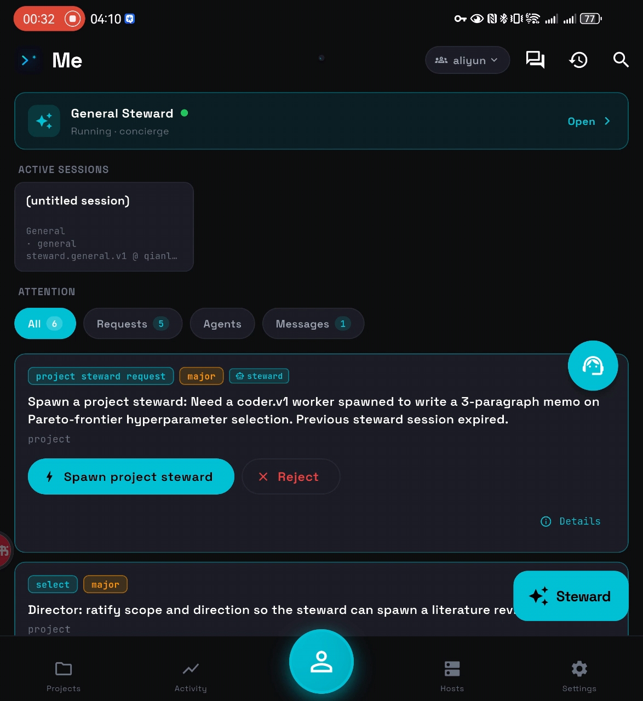

<p align="center">
  
</p>

<h1 align="center">TermiPod</h1>

<p align="center">
  <b>Mobile control plane for a fleet of AI agents.</b><br>
  <sub>Direct agents from your phone. A steward turns your goal into a plan, a fleet executes across your own hardware, you ratify and review.<br>Android, iOS, iPadOS — open source, self-hosted, Apache 2.0.</sub>
</p>

<p align="center">
  <a href="https://github.com/physercoe/termipod/releases"></a>
  <a href="LICENSE"></a>
  
  
  
  
</p>

<p align="center">
  <a href="README.zh.md">中文</a>
</p>

---

## What makes it different

Mobile agent apps are catching up on raw session count — several now juggle more than one session at a time. TermiPod isn't another session multiplexer; it's a **director's control plane**: you state a goal, a steward decomposes it into a plan and tasks, a governed fleet executes across your own machines, and the loop closes back to you.

- **Multi-agent fleet** — coordinate Claude Code, Codex, Gemini CLI, Kimi Code, or any CLI that takes a pty, each with its own pane, profile, and budget. One inbox for all of them.
- **Multi-host over your own infra** — a steward on a $5/mo VPS delegates work to a GPU box at home behind NAT, via A2A over a self-hosted reverse-tunnel relay. No cloud middleman holds your sessions.
- **Director, not operator** — write a natural-language goal. The steward decomposes it into a plan and a set of first-class **tasks**, dispatches workers, and you ratify. You don't author DAGs or babysit terminals.
- **Governed actions** — consequential moves are *proposed*, not silently executed: the steward surfaces them, you ratify. Backed by budget caps, policy overrides, per-agent usage, an immutable audit log, and team roles.
- **Closed-loop orchestration** — dispatched work routes back to you when it finishes or blocks, so you're notified instead of polling. The fleet itself — host-runners, agents, tokens — is startable, stoppable, and updatable from the phone.
- **Offline-first** — SQLite snapshot cache shows last-known-good lists on every screen when the hub is unreachable. Subway-safe.
- **Scales on a small VPS** — the Go hub drives a large fleet on cheap hardware with **zero added infrastructure** (no Redis, no managed DB at MVP): per-team SQLite sharding, a writer/reader pool split, and a deferred digest fold take it to **~1,000 concurrent agents on a 2 GB-RAM / 2-vCPU box with no write-error cliff** (load-tested). When you outgrow one box, a **selectable Postgres backend** is the designed scale-out path for HA and high write-concurrency.
- **Vendor-agnostic, self-hosted** — Apache 2.0 Go hub you run yourself. No account gating, no cloud relay, no vendor lock-in.

**30-second demo.** Type *ablation sweep on nanoGPT — tell me which optimizer scales better* on your phone. Your VPS steward decomposes it into a plan and a handful of **tasks**, then asks to spawn six training runs on your home GPU box — you tap **Approve**. The runs execute across hosts over A2A while you close the app. When the work finishes (or blocks), the loop closes back to you: a briefing with loss curves lands on your **Me** tab. You ratify it on the train home.

See [docs/discussions/positioning.md](docs/discussions/positioning.md) for the full thesis, ICP, and competitive analysis. The full doc index lives at [docs/README.md](docs/README.md).

---

## Demo

<p align="center">
  <a href="docs/screens/termipod-demo.mp4">
    
  </a>
</p>

> **⚠️ Preliminary preview — partial.** Captured on a real foldable
> device, before the Candidate-A hardware demo's final UX polish. It
> covers only part of the app and is not a full feature tour — shared
> for eager readers who want an early feel ahead of the proper demo.
> **Click the screenshot above to play the demo video**
> ([docs/screens/termipod-demo.mp4](docs/screens/termipod-demo.mp4)).
> A complete, CI-captured walkthrough is planned; design in
> [docs/discussions/screenshot-automation.md](docs/discussions/screenshot-automation.md).

---

## Why TermiPod?

AI agents produce ten times more output than any human can review. The moment you run **more than one** agent, or span **more than one machine**, the existing mobile tools show their seams. Session-bridge apps (Claude Code Remote Control, Happy, Tactic Remote, the Codex app) put a session — or now several — in your pocket, but each is still a window onto agents *you* launch and babysit; messenger-bridge agents (OpenClaw, Hermes, Claude Code Channels) give you one chat-style assistant across your chat apps. Neither decomposes a goal, dispatches a fleet across your own machines, and governs what those agents may do. TermiPod is built on a different axiom: the human is a **director**, not an operator.

| Dimension | Remote Control / Happy / Tactic / Codex | TermiPod |
|---|---|---|
| Topology | You ↔ sessions you launch by hand | Director → steward → fleet across M hosts |
| Agent count | Several, but each one started and driven by you | A fleet the steward spawns and coordinates |
| Host span | One machine you keep awake (some sync via the vendor's cloud) | VPS + GPU + laptop, coordinated over a self-hosted A2A relay |
| Agent vendor | Claude Code / Codex | claude-code, codex, gemini-cli, kimi-code — plus any pty CLI |
| Authoring model | You type messages turn by turn | Goal → steward decomposes into a plan + tasks; you ratify |
| Governance | Minimal | Governed-action propose/ratify, policies, budgets, audit log, roles |
| Data ownership | Vendor cloud or laptop-only | Hub holds names/events, hosts hold bytes — you run both |
| Offline | Needs a live connection | SQLite snapshot cache — last-known-good on every list |
| Open source | Mixed (Happy: yes; others: no) | Apache 2.0, self-hosted Go hub |

### Who is this for?

| | |
|---|---|
| **Solo ML researchers** | Nightly sweeps across a VPS + home GPU box — kick off from the phone, review briefings in the morning |
| **Indie AI hackers** | Multiple agent CLIs across projects — unified inbox, attention queue, per-pane profiles |
| **Autonomy-focused startups (1–5 eng)** | Budget caps, policy overrides, audit log, team roles — no other mobile agent tool has these |
| **Open-source maintainers** | Run triage / review agents overnight; approve agent PRs from bed |
| **Homelab / self-hosters** | Pull work off the laptop onto the phone without exposing raw SSH to the internet |

### When *not* to use TermiPod

Be honest: if you run exactly one Claude Code session on one machine and your laptop is always on, use [Anthropic's Remote Control](https://code.claude.com/docs/en/remote-control) or [Happy](https://happy.engineering/). TermiPod's governance, multi-host, and self-hosting features have a setup cost. You shouldn't pay it unless you need what they buy.

---

## Features

### SSH & Connectivity
- **Ed25519 / RSA keys** — generate on-device (RSA 2048 / 3072 / 4096) or import, stored in Android Keystore / iOS Keychain with optional passphrase, one-tap public-key copy
- **SSH ProxyJump** — connect through bastion/jump hosts to internal machines
- **SOCKS5 proxy** — route through corporate proxies, VPNs, or Shadowsocks/Clash
- **Raw PTY mode** — direct shell access for servers without tmux, with a one-tap shortcut from any tmux connection card
- **Connection testing** — verify SSH + tmux before saving
- **Auto-reconnect with exponential backoff** — up to 5 retries; commands you type while disconnected are queued and flushed automatically once the link is back
- **Latency indicator** — live ping in the header (color-coded: green &lt; 100 ms, red &gt; 500 ms) so you know whether the lag is your fingers or the network
- **Adaptive polling** — refresh rate ramps from 50 ms (active) down to 500 ms (idle) to save battery
- **Background connection service** — Android foreground service keeps SSH alive while the app is backgrounded; optional keep-screen-on for long sessions

### tmux Session Management
- **Dashboard** — recent sessions sorted by last access with relative timestamps ("Just now", "5 min ago"); one tap reconnects and restores the last window + pane
- **Visual navigation** — breadcrumb header: tap Session > Window > Pane to switch
- **Pane layout view** — accurate proportional split visualization, tap any pane to focus
- **Two-finger swipe** between panes
- **Pinch to zoom** the terminal (50%–500%) for quick readability bumps
- **Copy / scroll mode** — toggle to select text without the screen jumping; updates buffer until you exit and copy lands in the system clipboard
- **Create / rename / close** sessions and windows
- **Bell / Activity / Silence alerts** — tmux window flags monitored across all connections; tap any alert to jump straight to that window and pane (alert auto-clears)
- **256-color ANSI** terminal rendering with auto-extend scrollback

### Input UX (Mobile-Optimized)

| Component | What it does |
|-----------|-------------|
| **Action bar** | Swipeable button groups per profile — ESC, Tab, Ctrl+C, arrows, one tap away |
| **Compose bar** | Multi-line text field with send button. Multi-line input ships as **one bracketed paste** so AI agents and shells see the block intact, not N separate commands. Long-press send to omit Enter |
| **Direct Input mode** | Real-time keystroke streaming with a live indicator — every tap goes straight to the pty, ideal for vim, less, htop, REPLs |
| **Custom keyboard** | Flutter-native QWERTY with Ctrl/Alt/Esc/arrows. Built-in **live key strip** (Home / End / PgUp / PgDn / Del + pulse indicator) replaces the wasted compose-row gap. Arrow row auto-hides when nav pad / joystick is on. Toggle off entirely for CJK / voice input |
| **Navigation pad** | D-pad, joystick, or gesture surface for arrow keys + action buttons |
| **Snippets** | Slash commands with dropdowns for enums, text fields for free-form args. **Long-press the bolt key** to stash the current compose text as a draft snippet |
| **Modifier keys** | Ctrl / Alt as toggle buttons — tap to arm, double-tap to lock |

**4 built-in profiles** — Claude Code, Codex, General Terminal, tmux — each with optimized button groups. Create custom profiles for any CLI. Each pane remembers its profile and auto-detects from `pane_current_command`.

### File Transfer
- **SFTP upload/download** with progress tracking and remote directory browser
- **Image transfer** with format conversion, resize presets, and path injection

### Termipod Hub (optional)

Opt-in coordination layer for teams running multiple AI agents across machines. Paste a hub URL + bearer token in **Settings → Hub** and the five-tab IA — **Projects · Activity · Me · Hosts · Settings** — comes alive.

**Research-demo workflow:** write a project directive on the phone → a steward agent decomposes it into a plan → workers on GPU hosts execute runs in parallel via cross-host A2A → a briefing agent summarizes overnight into a reviewable document. Every step surfaces on the phone; you ratify, not operate. The MVP demo target is the locked **ablation-sweep** template (nanoGPT-Shakespeare optimizer × size; see [docs/decisions/001-locked-candidate-a.md](docs/decisions/001-locked-candidate-a.md)); paper-reproduction and benchmark-comparison templates are deferred until the demo lands.

**Me** (center, default) — your personal triage: pending approvals, urgent tasks, recent activity digest, and a Vault shortcut. Tap a pending approval to Approve / Reject inline.

**Projects** — project inventory; tap any row for the Project Detail surface with Overview, Tasks, Plans, Runs, Reviews, **Outputs** (run-produced checkpoints / curves / reports), Documents, Blobs, Channels, Schedules, and an Agents section walking `agent_spawns` for a parent→child org chart. FAB spawns workers via YAML with template picker, host picker, and saved presets; the Steward gets its own spawn flow. Metrics digests from **trackio / wandb / TensorBoard** auto-surface as inline sparklines on Run Detail. Project name / goal / template / docs root / budget are all editable inline.

**Activity** — team-wide audit feed (audit_events promoted): policy changes, template edits, agent lifecycle, channel posts, run state transitions — all in one filterable timeline.

**Hosts** — host-runner check-ins with last-seen timestamps; hosts behind NAT publish agent-cards to the hub directory and accept peer A2A calls via a **reverse-tunnel relay** so steward agents on a VPS can invoke workers on GPU machines end-to-end.

**Team** screen (header icon on Projects) — Members, Policies, team-scope channels (including the `#hub-meta` steward room, reachable from the AppBar chip), and Team Settings with cron **Schedules**, per-agent **Usage / budget** rollups, an **Audit log**, and the **Templates** browser for team-wide agent / prompt / policy YAML. Everything that drives behaviour — project templates, agent skills, launcher commands — is data you can edit on disk; no code changes required to add a new agent kind.

**Scaling & capacity.** The hub is built to run a real fleet on a **single cheap VPS**, no external services required. Storage and write-concurrency are sharded **per team** — `events.db` and `digest.db` are separate per-team SQLite files (each with its own writer), while the global `hub.db` holds names and events — and the per-agent digest fold runs off the ingest hot path on a bounded-staleness trigger, parallelized per team across cores. A writer/reader connection-pool split plus tuned SQLite pragmas (WAL, `synchronous=NORMAL`, mmap, bounded writer cache) remove the lock-contention cliff: a saturating load test on a **2 GB-RAM / 2-vCPU** box sustains **~1,000 events/sec through 200 agents (~760–850 ev/s under deep load)** and runs the full sweep **up to ~1,000 concurrent agents with zero `SQLITE_BUSY` errors**. The honest ceiling is **events/sec, not agent count** — and since real agents are bursty, the practical headroom is well above the saturating number. When one box isn't enough — HA, an off-box RAM-starved host, or sustained high write-concurrency — the storage backend is **selectable per store** (`sqlite | postgres`): SQLite is the zero-dependency default, an external managed Postgres the opt-in escape hatch (decided in [ADR-045](docs/decisions/045-hub-storage-scaling.md); SQLite sharding shipped, the Postgres backend is on the roadmap). Full analysis: [docs/discussions/hub-scaling-storage-and-concurrency.md](docs/discussions/hub-scaling-storage-and-concurrency.md).

The hub itself ships as a separate Go daemon under `hub/` — install with `go install` or run from source. See [docs/how-to/install-hub-server.md](docs/how-to/install-hub-server.md) for hub setup, [docs/how-to/install-host-runner.md](docs/how-to/install-host-runner.md) for adding a worker host, and [docs/how-to/run-the-demo.md](docs/how-to/run-the-demo.md) for the no-GPU dress rehearsal.

### Other
- **Data export / import** — full JSON backup of connections, keys, snippets, history, and settings; restore on a new device or migrate from the legacy MuxPod app
- **Built-in file browser** — manage SFTP downloads and app storage from Settings, share or delete files in place
- **Update checker** — Settings → Check for updates queries GitHub releases and links to the latest APK
- **Help & onboarding** — cheat sheet for action bar + tmux keybindings, 4-card walkthrough
- **Deep linking** — `termipod://connect?server=<id>&session=<n>&window=<n>&pane=<i>` opens a specific server / session / window / pane from external apps. Each connection has a stable **Deep Link ID** (set in Edit) so URLs survive renames; pairs with [claude-telegram-notify](https://github.com/launch52-ai/claude-telegram-notify) to tap a Telegram alert straight into the right pane. Legacy `muxpod://` URLs still resolve
- **Tablet & foldable** adaptive layout
- **i18n** — English and Chinese, follows system locale

---

## How TermiPod Compares

Against mobile **agent control** tools (session-bridge category):

| Feature | TermiPod | Claude Code Remote Control | Happy Coder | Tactic Remote |
|---|---|---|---|---|
| **Multi-agent fleet** | Yes — steward spawns + coordinates | Sessions, not a fleet | Sessions, not a fleet | Sessions, not a fleet |
| **Multi-host (A2A)** | Yes — VPS + GPU + NAT via relay | No | No | No |
| **Agent-agnostic** | Yes — any CLI | Claude Code only | Claude Code + Codex | Claude Code + Codex |
| **Director / steward model** | Yes — steward decomposes goals | No | No | No |
| **Governance (budget, audit, policy)** | Yes | No | No | No |
| **Self-hosted hub** | Yes (Go daemon) | Cloud relay (Anthropic API) | Relay server | Cloudflare Tunnel |
| **Offline snapshot cache** | Yes (SQLite) | No | No | No |
| **Platform** | Android + iOS + iPad | iOS + Android + Web | iOS + Android + Web | iOS only |
| **Pricing** | Free, Apache 2.0 | Claude Max ($100+) | Free, open source | Paid trial |

Against **messenger-bridge agents** (different thesis, overlapping user question):

| Feature | TermiPod | OpenClaw | Hermes Agent | Claude Code Channels |
|---|---|---|---|---|
| **UI surface** | Purpose-built mobile app | Existing messengers (WhatsApp, Telegram, Slack, Signal, iMessage, Discord, 15+) | Telegram / Discord / Slack / WhatsApp / Signal | Telegram + Discord |
| **Primary use case** | Fleet cockpit + research ops | Personal assistant across messengers | Personal assistant + self-improving skills | Remote Claude Code via chat |
| **Agent topology** | Director → steward → fleet | One agent, cross-platform memory | One self-improving agent | One local Claude Code session |
| **Multi-host / A2A** | Yes | No | No | No |
| **Plan ratification** | Structured plan + Approve | Conversational | Conversational | Conversational |
| **Governance UI** | Budgets, policy, audit | None (chat only) | None (chat only) | None |
| **Rich UI (plots, kanban, runs)** | Native | Text only | Text only | Text only |
| **Offline snapshot** | Yes | No | No | No |
| **Open source** | Apache 2.0 | MIT | Open | Plugin repo |
| **Vendor lock-in** | None | None | None | Requires Claude Pro/Max |

**When to pick which:** Use a messenger bridge when you want a personal agent answering in the apps you already use 20 hours/day. Use TermiPod when you're directing a **fleet** across your own infrastructure and need purpose-built screens for plans, runs, reviews, governance. The two coexist happily on the same phone.

Against mobile **SSH clients** (TermiPod also covers this layer — breakglass, not product):

| Feature | TermiPod | Termux | JuiceSSH | Termius | ConnectBot |
|---|---|---|---|---|---|
| **Platform** | Android + iOS + iPad | Android | Android | Multi | Android |
| **tmux integration** | Native visual | Manual CLI | None | None | None |
| **AI agent profiles** | Claude Code + Codex, per-pane | None | None | None | None |
| **SSH jump host** | Built-in | CLI | CLI | Built-in | None |
| **SOCKS5 proxy** | Built-in | CLI | None | None | None |
| **File transfer** | SFTP with UI | Local FS | None | SFTP | None |
| **Custom keyboard** | Flutter-native | None | None | None | None |
| **Open source** | Yes (Apache 2.0) | Yes | No | No | Yes |

---

## Quick Start

### Install

**Android:** Download the latest APK from [**Releases**](https://github.com/physercoe/termipod/releases) and install.

**iOS / iPadOS:** Build from source with Xcode (see below). TestFlight is on the roadmap.

### Build from source

```bash
git clone https://github.com/physercoe/termipod.git
cd termipod
flutter pub get

# Android
flutter build apk --release

# iOS / iPadOS (requires macOS + Xcode)
flutter build ios --release
```

### Connect

1. **Add a host** — Tap + on the **Hosts** tab, enter host / port / username
2. **Authenticate** — Password or SSH key (generate via the Keys tile on the host detail screen)
3. **Optional** — Configure jump host or SOCKS5 proxy in the connection form
4. **Navigate** — Expand host > session > window > pane
5. **Interact** — Action bar for quick keys, compose bar for commands, bolt button for snippets, [+] for file transfers

---

## Requirements

| Component | Requirement |
|-----------|-------------|
| **Device** | Android 8.0+ (API 26), iOS 13.0+, iPadOS 13.0+ |
| **Server** | Any SSH server (OpenSSH, Dropbear, etc.) |
| **tmux** | Any version (tested 2.9+) — optional with raw PTY mode |
| **Network** | Direct SSH, or via jump host / SOCKS5 proxy |

---

## Roadmap

The MVP target is the **research demo** described in
[docs/spine/blueprint.md](docs/spine/blueprint.md) §9 Phase 4: user
writes a directive → steward decomposes → fleet executes runs across
hosts → briefing agent summarizes overnight → user reviews on phone.

**Phase status (as of v1.0.808):**

| Phase | Status |
|---|---|
| P0 — Hub primitives (schema) | ✅ Shipped |
| P1 — Structured wire (protocols) | ✅ Shipped |
| P2 — App UI | ✅ Shipped |
| P3 — Integrations (trackio, A2A relay) | ✅ Shipped |
| P4 — Research demo | 🟡 Backend feature-complete; **hardware run remaining** |

The demo path is shipped end-to-end on the dress-rehearsal harness
(`seed-demo` + `mock-trainer`, no GPU needed). The actual hardware
run of Candidate A (nanoGPT-Shakespeare optimizer × size sweep) is
the MVP milestone — gated on two consecutive walkthrough-clean
device tests.

**Still open (post-demo):**

- **Briefing agent overnight schedule** — steward schedules the
  briefing autonomously (today the user fires it).
- **iOS TestFlight / App Store distribution** — Android APK ships;
  iOS builds are local-only today.
- **A2A peer auth** — per-agent tokens on the reverse-tunnel relay
  so cross-team calls can be authenticated end-to-end.
- **Domain packs / marketplace** — content-pack extensibility
  (post-MVP; see
  [docs/discussions/post-mvp-domain-packs.md](docs/discussions/post-mvp-domain-packs.md)).

Live trackers:
- [docs/roadmap.md](docs/roadmap.md) — Now / Next / Later
- [docs/plans/research-demo-gaps.md](docs/plans/research-demo-gaps.md) — demo-scoped detail
- [docs/changelog.md](docs/changelog.md) — what shipped per release
- [docs/decisions/](docs/decisions/) — ADRs (numbered, append-only)

---

## Attribution

TermiPod is a derivative work of [MuxPod](https://github.com/moezakura/mux-pod) by [@moezakura](https://github.com/moezakura) (Copyright 2025 mox), licensed under the [Apache License 2.0](LICENSE). The original MuxPod provided SSH connectivity and basic tmux session viewing for Android. TermiPod has since diverged substantially with cross-platform support, input UX redesign, agent profiles, SFTP, ProxyJump, SOCKS5, custom keyboard, and more. TermiPod is an independent project, not affiliated with the original author. See [NOTICE](NOTICE) for full attribution.

## Feedback

Found a bug or have a feature request? [Open an issue](https://github.com/physercoe/termipod/issues) or send feedback from **Settings > About** in the app.

## License

[Apache License 2.0](LICENSE)

---

<p align="center">
  <sub>Built with Flutter. Designed for mobile. Made for developers who live in the terminal.</sub>
</p>
