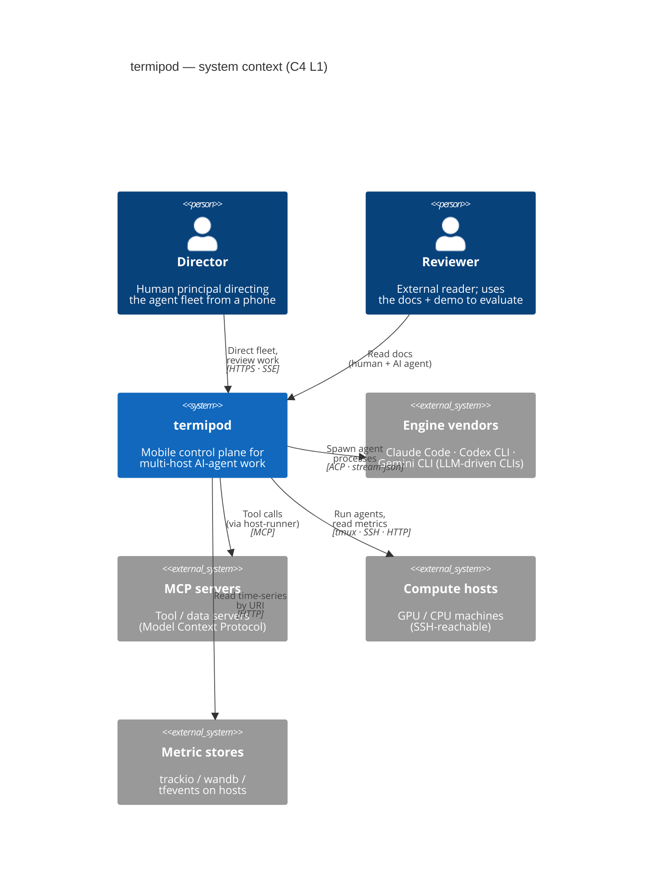
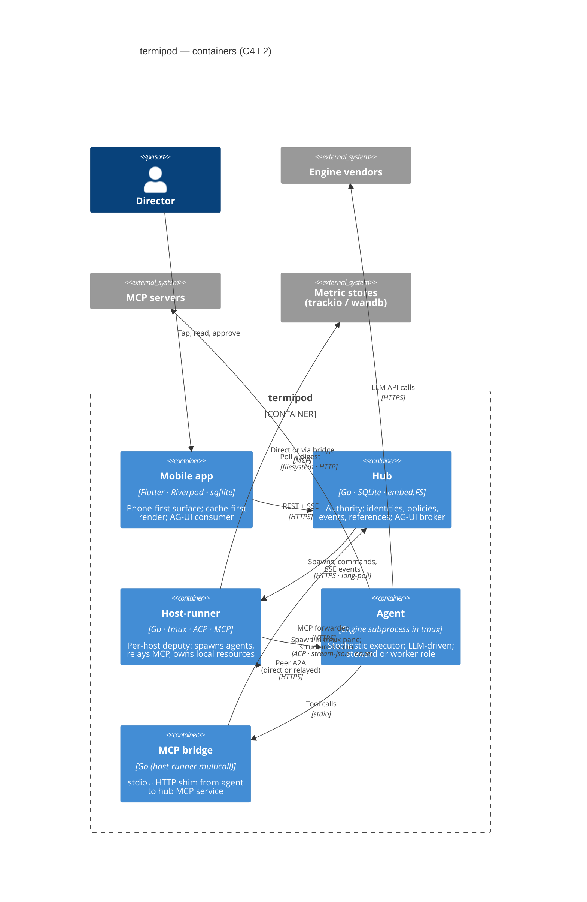

# Architecture overview

> **Type:** reference
> **Status:** Current (2026-05-05)
> **Audience:** contributors, reviewers
> **Last verified vs code:** v1.0.351

**TL;DR.** termipod in two pictures: a C4 Level 1 system context
diagram and a C4 Level 2 container diagram. Read this first if you're
new — it's the 30-second cold-start view. Deeper architecture lives in
[`../spine/blueprint.md`](../spine/blueprint.md) (axioms + ontology),
[`database-schema.md`](database-schema.md) (data model), and
[`api-overview.md`](api-overview.md) (HTTP surface).

---

## 1. System context (C4 L1)

termipod is a mobile-first control plane for AI-agent fleets. The
**director** (a researcher, lead, or solo principal) operates the
system from a phone; **agents** running on remote hosts do the
actual coding, training, analysis, and writing work, supervised by
the system and bounded by policy.



**External actors and systems:**

- **Director** — the human in front of the phone. Approves, redirects,
  and reviews; doesn't perform IC work. See ADR-005.
- **Reviewer** — an external reader of the docs + demo (often
  accompanied by AI agents inspecting the codebase). The docs are part
  of what they review.
- **Engine vendors** — Claude Code, Codex CLI, Gemini CLI. termipod
  spawns these as subprocesses; it does not implement an LLM loop.
- **MCP servers** — Model Context Protocol tool/data servers reached
  from agents via the host-runner's MCP gateway.
- **Compute hosts** — physical or virtual machines (GPU, CPU). Agents
  run on hosts; bytes (datasets, weights, checkpoints) live on hosts.
- **Metric stores** — `trackio` SQLite / `wandb-offline` JSONL /
  TensorBoard `tfevents` files on hosts. The hub stores only URIs.

The single architectural commitment captured at L1: **bytes stay near
compute**. The hub stores names, references, policies, and small
metadata only. See [`../spine/blueprint.md §4`](../spine/blueprint.md)
("Data ownership law").

---

## 2. Containers (C4 L2)



---

## 3. Per-container summary

### 3.1 Mobile app (`lib/`)

**Purpose.** The director's surface. Renders cached state immediately
on launch (cache-first per [ADR-006](../decisions/006-cache-first-cold-start.md)),
revalidates over the network, streams live updates over SSE.

**Tech stack.** Flutter 3.24+, Dart 3.x, `flutter_riverpod` (state),
`sqflite` (SQLite cache), `flutter_secure_storage` (keychain),
`dartssh2` (SSH for Enter-pane), `xterm` (terminal view).

**Owns:** SSH credentials, hub bearer tokens, the local snapshot cache
(`HubSnapshotCache`), `hub_host_bindings` (mobile-only — maps hub host
ids to local Connection records). Per the data-ownership law, the
mobile app holds device-only secrets and a derived view of hub state.

**Doesn't own:** authoritative state. Every mutation goes through the
hub.

### 3.2 Hub (`hub/cmd/hub-server`)

**Purpose.** Authority. The single coherent world-model the director
consults. Holds names (identities, projects), policies (tiers,
budgets), and an event log; brokers AG-UI from internal events.

**Tech stack.** Go 1.23+, SQLite (single file at
`<dataRoot>/hub.db`), append-only event log
(`<dataRoot>/event_log/*.jsonl`), `embed.FS` for bundled templates,
`runtime/debug.ReadBuildInfo` for build metadata.

**Owns:** identities (agents, hosts, users, tokens — hashed), audit
events, project/plan/run/document/review metadata, channel messages
(under ~256 KB), template bundles, attention queue. **Authoritative
for everything except bulk content.**

**Doesn't own:** bulk bytes (model weights, datasets, checkpoints,
tensors). Those stay on hosts; the hub stores URIs.

**Deployment.** Single VPS or laptop; binary self-contained. Production
deploy uses systemd + nginx + Let's Encrypt — see
[`../how-to/install-hub-server.md`](../how-to/install-hub-server.md).

### 3.3 Host-runner (`hub/cmd/host-runner`)

**Purpose.** The deterministic local deputy on each host. Spawns
agents in tmux panes, relays agent MCP calls to the hub, exposes A2A
endpoints, polls metric files, heartbeats to the hub. **Survives hub
outages** (buffers writes, serves cached reads).

**Tech stack.** Go 1.23+, `tmux` 3.2+ for pane management. Same binary
also serves as `hub-mcp-bridge` (multicall) when invoked via symlink.

**Owns:** local panes / windows / sessions, worktrees, local
secrets, ACP sessions, A2A endpoints, metric-file pollers,
`hub-mcp-bridge` UDS/stdio.

**Doesn't own:** agent identity (rows in `agents` live on the hub),
authoritative policy (consults hub), bulk content (forwards refs).

**Deployment.** Per-host systemd unit (or tmux for dev). One instance
per login user — see
[`../how-to/install-host-runner.md`](../how-to/install-host-runner.md).

### 3.4 Agent (engine subprocess)

**Purpose.** The stochastic LLM-driven executor that produces work.
Spawned by the host-runner into a tmux pane; speaks one of three
driving modes (M1 ACP / M2 stream-json / M4 pane-only) per
[`../spine/blueprint.md §5.3.1`](../spine/blueprint.md).

**Tech stack.** Whichever engine vendor's CLI is installed for the
host's login user — Claude Code (`claude`), Codex (`codex`), or
Gemini (`gemini`). termipod does not link any LLM.

**Owns:** its own conversation context, tool-call decisions, working
directory.

**Doesn't own:** policy, lifecycle (the host-runner spawns / reaps),
hub identities (the host-runner stamps them on relayed MCP calls).

**Roles.** Two role-distinguished classes:

- **Steward** — manager / orchestrator. Plans, decides, spawns workers,
  arbitrates approvals. Two tiers: *general* (frozen, persistent
  team-scoped per [ADR-017](../decisions/017-layered-stewards.md))
  and *domain* (overlay-authored, project-scoped).
- **Worker** — IC. Bounded, specific work in a worktree. Spawned by a
  steward (or another worker) for one task.

### 3.5 MCP bridge (`hub/cmd/hub-mcp-bridge` — same binary as host-runner)

**Purpose.** stdio↔HTTP shim that lets a spawned agent reach the
hub's MCP service. Agents never open direct connections to the hub
(forbidden pattern §3 in blueprint); all hub MCP calls traverse:

```
agent (MCP client over stdio) → hub-mcp-bridge → host-runner MCP gateway → hub HTTP
```

The host-runner stamps the agent's identity, enforces local rate
limits, reuses its single persistent hub token. See ADR-002 for the
single-MCP-service consolidation.

---

## 4. Communication patterns

| Edge | Type | Protocol | Transport | Spec |
|---|---|---|---|---|
| Director ↔ Mobile | UI | tap / gesture | local | — |
| Mobile ↔ Hub | sync + stream | termipod REST + SSE | HTTPS | [`api-overview.md`](api-overview.md) |
| Mobile ↔ Hub (live agent feed) | observation | AG-UI events | SSE/HTTPS | [`../spine/blueprint.md §5.5`](../spine/blueprint.md) |
| Hub ↔ Host-runner | control | termipod REST | HTTPS, host-initiated | [`../reference/hub-agents.md`](hub-agents.md) |
| Host-runner ↔ Agent (M1) | supervision | ACP | JSON-RPC over stdio | [`../spine/blueprint.md §5.3`](../spine/blueprint.md) |
| Host-runner ↔ Agent (M2) | supervision | stream-json | JSON-line over stdio | [`frame-profiles.md`](frame-profiles.md) |
| Host-runner ↔ Agent (M4) | observation | tmux pane scrape | tty | — |
| Agent ↔ Hub (authority) | RPC-with-cap | MCP via bridge → host-runner gateway | stdio + HTTPS | [ADR-002](../decisions/002-mcp-consolidation.md) |
| Agent ↔ Host-runner (local caps) | RPC-with-cap | MCP | UDS / localhost | [`../spine/blueprint.md §5.1`](../spine/blueprint.md) |
| Agent ↔ Agent | peer | A2A (direct or hub-relayed) | HTTPS | [ADR-003](../decisions/003-a2a-relay-required.md), [ADR-007](../decisions/007-mcp-vs-a2a-protocol-roles.md) |
| Agent ↔ Engine vendor | LLM API | vendor-specific | HTTPS | engine docs |

The protocol per edge is *forced by the relationship type*, not chosen
by fashion — see [`../spine/blueprint.md §5`](../spine/blueprint.md)
("Protocol layering").

---

## 5. Tech stack at a glance

| Layer | Choice | Why |
|---|---|---|
| Mobile language | Dart 3.x / Flutter 3.24+ | Cross-platform; single codebase Android-primary, iOS-secondary |
| Mobile state | `flutter_riverpod` | Family providers + autoDispose match cache-first model |
| Mobile cache | `sqflite` (SQLite) | Tabular cache mirrors hub schema; same ER |
| Mobile secrets | `flutter_secure_storage` | OS keychain / Keystore — bearer tokens, SSH keys |
| Hub language | Go 1.23+ | Static binary, low ops cost on a $5 VPS, strong stdlib HTTP/SQLite |
| Hub store | SQLite + append-only JSONL log | Single-file durability; reconstruct-DB from log on corruption |
| Hub templates | `embed.FS` | Bundled at build; user edits override on first init |
| Host-runner | Go 1.23+ | Same toolchain as hub; cross-compile; multicall binary |
| Tmux | 3.2+ | Required for `-F` format vars used by the launcher |
| Engines | Claude Code / Codex / Gemini | Operator's choice per host; declared in template |
| Metric tracking | trackio (primary) / wandb-offline / TensorBoard | Operator's choice; host-runner reads file format and digests |

For full mobile package list see `pubspec.yaml`; for hub deps see
`hub/go.mod`.

---

## 6. Deployment topology

Single tenant, single team, single hub (per
[ADR-018](../decisions/018-tailnet-deployment-assumption.md): hub ↔
host-runner connectivity assumes a Tailnet or equivalent overlay).
Topology:

```
┌─────────────────┐        ┌─────────────────────┐
│  Phone (Flutter)│ ◀────▶ │      Hub (Go)       │
└─────────────────┘ HTTPS  │  on a VPS / laptop  │
                            └────────┬────────────┘
                                     │ Tailnet or LAN
                  ┌──────────────────┼──────────────────┐
                  ▼                  ▼                  ▼
        ┌──────────────┐  ┌──────────────┐  ┌──────────────┐
        │ Host A       │  │ Host B (GPU) │  │ Host C       │
        │  host-runner │  │  host-runner │  │  host-runner │
        │  + agents    │  │  + trainer   │  │  + agents    │
        │    in tmux   │  │    in tmux   │  │    in tmux   │
        └──────────────┘  └──────────────┘  └──────────────┘
```

- Each host runs **one host-runner per login user** (the SSH user the
  mobile app attaches as).
- Hosts behind NAT use the hub's A2A relay
  ([ADR-003](../decisions/003-a2a-relay-required.md)) for cross-host
  agent-to-agent calls.
- The hub fronts all client traffic; nothing connects to host-runner
  directly from the phone except SSH (for Enter-pane).

---

## 7. Quality goals at a glance

Pulled from blueprint axioms; full quantification is planned in
`quality-attributes.md` (P2.10 in `../plans/doc-uplift.md`).

- **A1 — Filtering.** Mobile cold-start renders cache in ≤200ms;
  attention items + AG-UI events arrive over SSE without polling.
- **A2 — Distribution.** Hub never holds bulk content; all bytes that
  exceed ~256 KB live on the host with a URI in the hub.
- **A3 — Governance.** Every mutation lands in `audit_events`; every
  agent action passes through host-runner's MCP gateway with the agent
  identity stamped.

Stochastic behavior is **bounded by rules that existed before the
action happened** — policies, scopes, budgets — never adjudicated
post-hoc by another LLM.

---

## 8. Reading-order guide for new contributors

In priority order (each ~10–30 min):

1. [`../spine/blueprint.md`](../spine/blueprint.md) — three axioms,
   ontology, data-ownership law, protocol layering
2. [`../spine/information-architecture.md`](../spine/information-architecture.md)
   — mobile IA, role ontology, entity × surface matrix
3. [`../spine/agent-lifecycle.md`](../spine/agent-lifecycle.md) — how
   an agent is born, lives, dies
4. [`../spine/sessions.md`](../spine/sessions.md) — session ontology
5. [`database-schema.md`](database-schema.md) — full ER + per-table
   summaries
6. [`api-overview.md`](api-overview.md) — endpoint index +
   cross-cutting conventions
7. [`../spine/system-flows.md`](../spine/system-flows.md) — sequence
   diagrams for 8 critical flows
8. [`cross-cutting.md`](cross-cutting.md) — security, observability,
   error handling, perf budgets
9. [`../decisions/`](../decisions/) — ADRs explaining specific choices
10. [`glossary.md`](glossary.md) — when a term feels overloaded

For installation + walkthroughs see
[`../how-to/install-hub-server.md`](../how-to/install-hub-server.md)
and
[`../how-to/run-the-demo.md`](../how-to/run-the-demo.md). For
contributor cold-start see
[`../how-to/local-dev-environment.md`](../how-to/local-dev-environment.md).

---

## 9. Cross-references

- [`../spine/blueprint.md`](../spine/blueprint.md) — axioms +
  ontology + protocol layering (more depth than this overview)
- [`database-schema.md`](database-schema.md) — physical schema (this
  doc only names containers; that doc names tables)
- [`api-overview.md`](api-overview.md) — HTTP endpoints
- [`../spine/system-flows.md`](../spine/system-flows.md) — sequence
  diagrams
- [`cross-cutting.md`](cross-cutting.md) — security, observability,
  perf
- [`hub-agents.md`](hub-agents.md) — agent lifecycle + spawn API
- [`hub-api-deliverables.md`](hub-api-deliverables.md) — project /
  lifecycle endpoints
- [`../decisions/`](../decisions/) — full ADR index
