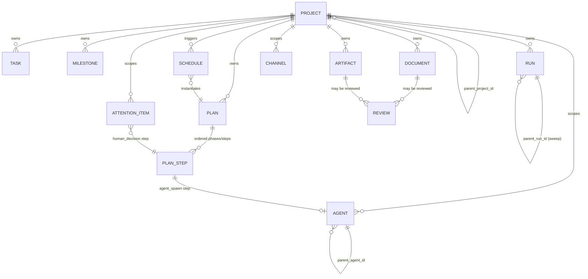

# Data model — core primitives

> **Type:** reference
> **Status:** Current (2026-05-05)
> **Audience:** contributors
> **Last verified vs code:** v1.0.351

**TL;DR.** Conceptual data model: Projects, Plans, Schedules, Agents,
Runs, Artifacts, Documents, Reviews, Channels, Tasks, Attention,
Briefings — what each primitive *is* and how it relates to the
others. Physical schema (tables, columns, indexes) is in
[`database-schema.md`](database-schema.md); this doc is the
definition layer extracted from the original `blueprint.md` §6 (P1.6
doc-uplift refactor).

---

## 1. Projects (subsume "directives")

A **project** is the unit of bounded work. Every running agent, run,
task, document, and artifact belongs to a project. Projects nest.
Projects can be templates (parameterized, reusable) or instances
(bound, active).

Fields (canonical column names):

- `id, team_id, name, goal`
- `kind` ∈ {`goal`, `standing`} (default `goal`; see below)
- `parent_project_id` (nullable, enables nesting)
- `template_id` (nullable, references a parent template)
- `parameters_json` (bound values when instantiating a template)
- `is_template` (boolean)
- `budget_cents` (compute + API spend cap, inherited by children)
- `policy_overrides_json` (tier adjustments scoped to this project)
- `steward_agent_id` (the steward-of-record that decomposes the goal)
- `on_create_template_id` (nullable — a plan template auto-instantiated
  when the project is created; lets standing projects bootstrap
  channels, docs, and routine schedules on day one)
- `archived_at`

Templates emerge as a lab's methodology ("reproduce a paper",
"ablation sweep", "red-team an MLE model"). Instances inherit the
decomposition plan from their template, bind parameters, and start
running.

**Project kinds.** Two kinds, distinguished at create time:

- `goal` — bounded, has a completion condition, closes. The default.
  Example: "reproduce the X paper," "ship feature Y." UI shows
  progress and a closable state.
- `standing` — ongoing container for routine work; never closes.
  Example: "Infra operations," "Daily briefings," "Lab triage." UI
  shows recent runs of its schedules rather than progress.

Kind affects UI presentation and default lifecycle, not the
underlying schema.

The previously proposed `directives` primitive is retired; it is
subsumed by `project.goal` + `project.template_id` +
`project.parameters_json`.

---

## 2. Plans

A **plan** is an ordered, reviewable scaffold of phases that execute
the project's goal. Plans are how humans preview what a steward or
the system is about to do before it happens — A1 (attention) demands
this.

A plan is **shallow by construction**: a linear list of named phases.
No loops, no conditionals, no DAGs at the plan level. Dynamic
behavior lives *inside* `agent_driven` phases, where a steward
interprets the phase goal with flexibility bounded by budget and
policy. This keeps plans reviewable (a human can read them) and
keeps stochasticity confined to the layer designed for it.

Fields:

- `id, project_id, template_id` (nullable), `version`
- `spec_json` — ordered phases (see below)
- `status` ∈ {`draft`, `ready`, `running`, `completed`, `failed`,
  `cancelled`}
- `created_at, started_at, completed_at`

Phase schema (inside `spec_json`):

- `name, goal, budget_cents`
- `kind` ∈ {`deterministic`, `agent_driven`, `human_gated`}
- For `deterministic`: ordered `steps` list (step kinds below).
- For `agent_driven`: a `steward` block — template ref for the
  steward agent to spawn, plus its driving mode and budget envelope.
- For `human_gated`: a `prompt` + optional `choices`; blocks until a
  human acts.

**Step kinds (deterministic-phase steps only):**

| Kind | Purpose |
|---|---|
| `agent_spawn` | Spawn an M1/M2/M4 agent, wait for termination, capture artifacts |
| `llm_call` | One-shot inference (e.g. `claude -p … --output-format stream-json`). No persistent agent. Captures text/artifact output |
| `shell` | Run a shell command on the host (with policy gate) |
| `mcp_call` | Invoke one named MCP tool and capture the result |
| `human_decision` | Block for an explicit user approval/choice (equivalent to a one-step `human_gated` phase) |

Plan executor table `plan_steps`:

- `id, plan_id, phase_idx, step_idx, kind, spec_json`
- `status, started_at, completed_at`
- `input_refs_json, output_refs_json` (artifact URIs, document IDs,
  etc.)
- `agent_id` (nullable — set for `agent_spawn` steps)

`deterministic` phases are executed by host-runner's plan-step
executor; `agent_driven` phases are executed by the spawned steward
(host-runner spawns it, waits, reaps). `human_gated` phases are
mediated by the hub.

The in-app term for a reusable plan template is **workflow**; it's a
UI label, not a schema primitive. A "workflow" is shorthand for
`template_id → plan_spec + schedule + execution history`.

---

## 3. Schedules

A **schedule** triggers a plan from a template. It generalizes and
replaces the earlier `agent_schedules` table, which spawned agents
directly — a now-forbidden shortcut
([`../spine/forbidden-patterns.md`](../spine/forbidden-patterns.md) #11).

Fields:

- `id, project_id, template_id`
- `trigger_kind` ∈ {`cron`, `manual`, `on_create`}
- `cron_expr` (for `cron`)
- `parameters_json` (bound values passed to the template at
  instantiation)
- `enabled, next_run_at, last_run_at, last_plan_id, created_at`

MVP trigger kinds:

- `cron` — time-based (the 80% case: nightly benchmarks, daily
  briefings).
- `manual` — the user taps "Run now"; same code path as cron.
- `on_create` — fires once when the owning project is created; lets a
  template bootstrap a standing project.

Deferred (explicitly named but not built): event-triggered schedules
(on artifact produced, on agent completed across projects) and
conditional schedules (run only if precondition met). These require
a cross-plan event bus that MVP doesn't need.

Briefings reduce to a scheduled plan whose template is a
briefing-template (steward agent → digest document → push); no
dedicated briefings table post-migration (§10 historical note).

---

## 4. Agents

LLM processes with identity, lifecycle (spawned → running → paused →
terminated → archived), host assignment, project membership, spawn
authority with budget caps.

Existing schema. No change required except adding `project_id`
foreign key if not present, and ensuring `archived_at` aligns with
project archival. A new nullable `plan_step_id` links agent-spawn
steps back to their owning plan-step (populated for agents spawned
via a plan).

See [`../spine/agent-lifecycle.md`](../spine/agent-lifecycle.md) for
state semantics and [`hub-agents.md`](hub-agents.md) for the API
surface.

---

## 5. Runs

Unit of single execution with reproducibility contract. Frozen
config at start; metrics time-series stored on the host via trackio
and referenced by URI on the hub.

Fields:

- `id, project_id, agent_id, config_json, seed, status`
- `started_at, finished_at`
- `trackio_host_id, trackio_run_uri` (reference, not content)
- `parent_run_id` (for sweeps)

Metrics never live on the hub. The phone fetches them from the
host's trackio via a hub-signed URL.

---

## 6. Artifacts

References to produced content. Hub stores metadata; bytes stay on
host or in cloud.

Fields:

- `id, project_id, run_id` (nullable)
- `sha256, size, uri` (host://, s3://, hf://, …)
- `mime, producer_agent_id, created_at`
- `lineage_json` (which run/agent produced it, from which inputs)

---

## 7. Documents

Structured writeups: memos, drafts, reports, reviews. Versioned per
project. Small text stored inline; large documents stored as
artifacts with a metadata row.

Fields:

- `id, project_id, kind (memo|draft|report|review), title`
- `version, prev_version_id, content_inline` (if small)
- `artifact_id` (if large)
- `author_agent_id, created_at`

---

## 8. Reviews

Human-review queue. A review attaches to a document or artifact and
has states: pending → approved | request-changes | rejected. Visible
to the requesting agent so it can proceed or iterate.

Fields:

- `id, project_id, target_kind (document|artifact), target_id`
- `requester_agent_id, state, decided_by_user_id, decided_at,
  comment`

---

## 9. Channels

Ambient message streams at team or project scope. Agents post via
MCP for broadcast, group coordination, and ambient state updates
that don't fit A2A's bilateral task shape. See
[ADR-019](../decisions/019-channels-as-event-log.md).

---

## 10. Briefings (specialization, not a primitive)

A briefing is a scheduled plan whose template's single `agent_driven`
phase spawns a briefing steward that reads recent activity and emits
a digest document + push. No dedicated `briefings` table is needed
once plans and schedules exist; a briefing is fully described by
`schedules.template_id` + the resulting plan + its output document.

---

## 11. Attention / approvals

Retained. AG-UI's pause-for-approval event type is the wire format
for these. No separate primitive needed at the data-model level
beyond the `attention_items` table — see
[`attention-delivery-surfaces.md`](attention-delivery-surfaces.md)
for the lifecycle and
[`attention-kinds.md`](attention-kinds.md) for the kind taxonomy.

---

## 12. Primitives by axis (mental-model index)

The primitives above factor onto orthogonal axes. Placing them on
one table removes the "is X like Y?" confusion that arises when the
list reads as a flat enumeration:

| Axis | Primitives | What the axis models |
|---|---|---|
| **Trigger** | Schedule | When work starts |
| **Procedure** | Plan, Plan step, Phase (JSON-embedded) | What will run, in what order — the reviewable recipe |
| **Execution** | Agent, Run | Living actor · ML experiment record |
| **Output** | Artifact, Document | Bytes produced · authored text |
| **Gate** | Review, Attention item | Human decisions blocking progress |
| **Work-tracking** | Task, Milestone | Kanban for work that isn't plan-driven |
| **Context** | Project, Channel, Event, Host | Container · conversation · message · machine |

**Two-lane model for human work.** Plan-driven human gates use
`plan_step(kind=human_decision)` → `attention_item` (plan pauses,
director acts on Me tab, plan resumes). Director-authored work
(refactor a trainer, triage a paper) uses `task` — independent of
plans, kanban lifecycle. Both are legitimate; they address different
intents. `task.plan_step_id` is deliberately absent — tasks are not
plan outputs.

**Phase is not a primitive.** Phases exist only as JSON objects
inside `plans.spec_json` — they're typed containers (`deterministic`
/ `agent_driven` / `human_gated`) that group steps and carry a
budget envelope, but have no independent state. A phase's status is
derived from its steps' statuses. `plan_steps.phase_idx` is the only
place a phase is materialised, and only for deterministic phases
(the other two kinds have no per-step rows — they produce one agent
or one human decision each).

**"Run" is a domain primitive, not a workflow-execution primitive.**
It models a single ML training/eval with frozen config + seed +
trackio metrics. The word clashes with "workflow run" in other
systems, where a Plan's execution would be called a "run". To avoid
this ambiguity the UI labels `runs` as **Experiments**; the DB name
stays `runs` for migration continuity.

---

## 13. Deferred: reusable step registry (action templates)

Plan steps today are specified inline in `plans.spec_json`. Reuse
happens at plan-template granularity (whole plan) but not at step
granularity. GitHub Actions / Airflow Operators / Temporal
Activities solve this with a step-level registry of named,
parameterised operations.

Termipod intentionally defers this. It adds real expressiveness
(marketplace-style sharing of `llm_call summarise-paper`, `shell
run-pytest`, etc.) but also real governance load (who publishes
them, how they're audited, how breaking changes roll forward). Plan
templates cover the demo and near-term goals.

When added, the shape is:

- `action_templates` table (`id, kind, spec_json, owner, version`).
- Plan step spec can reference `action_template_id` +
  `parameters_json` instead of inline `spec_json`.
- Action templates are team-scoped primitives like plan templates.

No schema break required — `plan_steps.spec_json` can continue to
carry inline specs for one-offs. Marked F-TBD in the roadmap.

---

## 14. Cross-references

- [`../spine/blueprint.md`](../spine/blueprint.md) — the surrounding
  spine doc this was extracted from
- [`database-schema.md`](database-schema.md) — physical schema (tables,
  columns, indexes)
- [`../spine/protocols.md`](../spine/protocols.md) — protocol
  layering that consumes these primitives
- [`../spine/forbidden-patterns.md`](../spine/forbidden-patterns.md)
  — the rules that follow from this model
- [`../spine/agent-lifecycle.md`](../spine/agent-lifecycle.md) — agent
  state semantics (§4 Agents)
- [`hub-agents.md`](hub-agents.md) — agent API surface
- [`hub-api-deliverables.md`](hub-api-deliverables.md) — project
  lifecycle endpoints
- [`audit-events.md`](audit-events.md) — mutation audit taxonomy
- [`../decisions/019-channels-as-event-log.md`](../decisions/019-channels-as-event-log.md)
  — channels as event log (§9)
