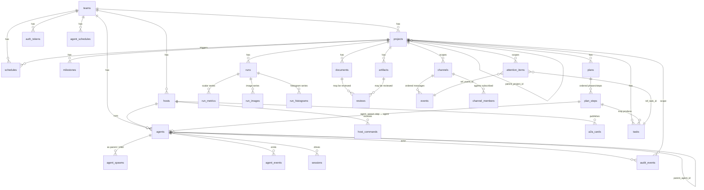
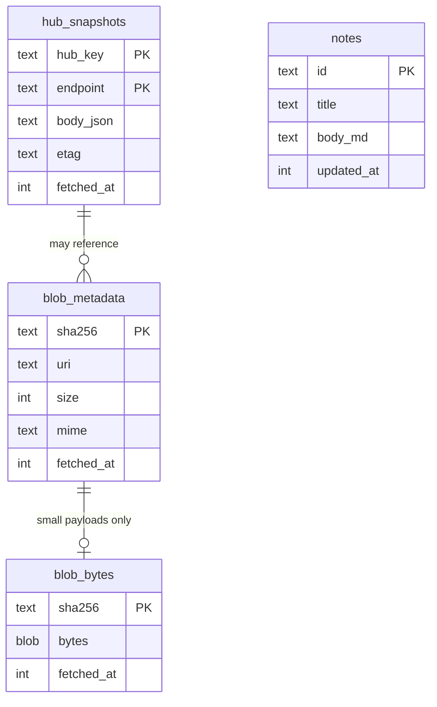

# Database schema

> **Type:** reference
> **Status:** Current (2026-05-05)
> **Audience:** contributors
> **Last verified vs code:** v1.0.351

**TL;DR.** Every table on the hub side and every cache table on the
mobile side, grouped by domain. One ER diagram per side; per-table
summaries with links to detailed reference docs where one exists; the
ownership rule that decides what lives where. Migration head is
`hub/migrations/0033_sessions_engine_session_id.up.sql`.

This doc is the **single canonical entry** for "where is data X
stored?" Per-feature reference docs (e.g.,
[`project-phase-schema.md`](project-phase-schema.md),
[`audit-events.md`](audit-events.md)) own the *details* of one
domain; this doc links them up under one ER view.

---

## 1. Scope

This doc covers two stores:

1. **Hub-side** — authoritative SQLite database at
   `<dataRoot>/hub.db` (Track A) or `/var/lib/termipod-hub/hub.db`
   (Track B). All persistent server state lives here. Append-only
   event log at `<dataRoot>/event_log/*.jsonl` mirrors mutations for
   reconstruction (`hub-server reconstruct-db`).
2. **Mobile-side** — SQLite cache at the platform's app-data path,
   plus `SharedPreferences` for config and `flutter_secure_storage`
   for secrets.

**Per the data-ownership law** ([`../spine/blueprint.md §4`](../spine/blueprint.md)):
the hub stores names, references, policies, and small metadata
only. Bulk content (model weights, datasets, checkpoints, large
documents) lives on hosts; the hub holds URIs.

---

## 2. Hub-side ER

The diagram is illustrative — see §3 for full per-table fields.

---

## 3. Hub-side tables

Grouped by domain. Each row is **table → primary purpose → linked
detailed reference**.

### 3.1 Identity + auth

| Table | Purpose | Detail |
|---|---|---|
| `teams` | Team identifier (one team per data root in MVP) | — |
| `auth_tokens` | Bearer tokens (SHA-256 hashed); `kind` ∈ owner / host / agent / user; scope JSON | [`permission-model.md`](permission-model.md) |
| `hosts` | Each registered host-runner: `name`, `status`, `last_seen_at`, `capabilities_json` (binaries probed), `ssh_hint_json` (non-secret), runner build metadata | [`hub-agents.md`](hub-agents.md) |
| `agents` | Live agent rows: `handle`, `kind` (claude-code / codex / gemini / …), `status` (pending / running / stale / paused / terminated / archived), `host_id`, `pane_id`, `parent_agent_id`, `budget_cents`, `driving_mode` | [`hub-agents.md`](hub-agents.md), [`../spine/agent-lifecycle.md`](../spine/agent-lifecycle.md) |
| `agent_spawns` | Spawn-request log with embedded `spawn_spec_yaml`, `mcp_token`, `task_json` (handoff context) | [`hub-agents.md`](hub-agents.md) |
| `host_commands` | Out-of-band commands (pane capture, tmux signals) queued for host-runner | — |
| `a2a_cards` | Agent-card directory entries; published by host-runners on heartbeat | [ADR-003](../decisions/003-a2a-relay-required.md) |

### 3.2 Project structure

| Table | Purpose | Detail |
|---|---|---|
| `projects` | Bounded unit of work; nests via `parent_project_id`; `kind` ∈ goal / standing; `template_id`, `parameters_json`, `is_template`, `budget_cents`, `policy_overrides_json`, `steward_agent_id`, `phase`, `phase_history_json` | [`../spine/blueprint.md §6.1`](../spine/blueprint.md), [`project-phase-schema.md`](project-phase-schema.md) |
| `milestones` | Project-scoped milestones with `due_at`, `status` | — |
| `tasks` | Project-scoped tasks; `parent_task_id` for sub-tasks; `priority`; `plan_step_id` (nullable, for plan-emitted tasks) | — |
| `plans` | Reviewable scaffold: ordered phases inside `spec_json`; `status` ∈ draft / ready / running / completed / failed / cancelled | [`../spine/blueprint.md §6.2`](../spine/blueprint.md) |
| `plan_steps` | Materialised steps for deterministic phases; `kind` ∈ agent_spawn / llm_call / shell / mcp_call / human_decision; `input_refs_json`, `output_refs_json`, `agent_id` (for agent_spawn) | — |
| `schedules` | Generalises `agent_schedules`; `trigger_kind` ∈ cron / manual / on_create; instantiates a plan from `template_id` + `parameters_json` | [`../spine/blueprint.md §6.3`](../spine/blueprint.md) |
| `agent_schedules` | Legacy direct-spawn schedules; superseded by `schedules`; ports forward via migration 0010 | — |

Lifecycle deliverables (post-2026-05): see
[`project-phase-schema.md`](project-phase-schema.md) for the new
`deliverables`, `deliverable_components`, `acceptance_criteria` tables
introduced by the project-lifecycle MVP plan (not yet in migrations
head; ships in W1 of [`../plans/project-lifecycle-mvp.md`](../plans/project-lifecycle-mvp.md)).

### 3.3 Experiments (runs)

| Table | Purpose | Detail |
|---|---|---|
| `runs` | One ML training/eval execution; frozen `config_json` + `seed`; `trackio_host_id` + `trackio_run_uri` (reference, not content); `parent_run_id` for sweeps; `status`, `final_metrics_json` | [`../spine/blueprint.md §6.5`](../spine/blueprint.md) |
| `run_metrics` | Downsampled scalar time-series (≤100 points) per metric per run; produced by host-runner's metric poller from trackio / wandb / tfevents | — |
| `run_images` | Image-series checkpoints (e.g., generated samples, attention heatmaps) | — |
| `run_histograms` | Histogram-series checkpoints (e.g., gradient distributions) | — |

### 3.4 Documents + artifacts

| Table | Purpose | Detail |
|---|---|---|
| `documents` | Authored text (memos, drafts, reports, reviews); `kind`, `version`, `prev_version_id`, `content_inline` (small) or `artifact_id` (large) | — |
| `artifacts` | Content-addressed references; `sha256`, `size`, `uri` (host:// / s3:// / hf:// / …), `mime`, `producer_agent_id`, `lineage_json` | — |
| `reviews` | Human-review queue attached to a document or artifact; `state` ∈ pending / approved / request-changes / rejected | — |
| `blobs` | Hub-managed small attachments under ~256 KB ceiling; sha256 dedup | — |

### 3.5 Communication

| Table | Purpose | Detail |
|---|---|---|
| `channels` | Ambient streams at team or project scope | [ADR-019](../decisions/019-channels-as-event-log.md) |
| `channel_members` | Agent subscriptions; `follow_mode` ∈ full / mention; `muted` | — |
| `events` | Append-only event log per channel; `task_id` + `correlation_id` for threading; `parts_json` payload; FTS5 index `events_fts` | [ADR-019](../decisions/019-channels-as-event-log.md) |
| `agent_events` | Per-agent AG-UI event stream (lifecycle, text, tool-call, diff, A2A invoke/response); FTS5 indexed; `producer` distinguishes engine-emitted vs hub-synthesized | [`../spine/blueprint.md §5.5`](../spine/blueprint.md) |
| `sessions` | Conversational primitive that survives respawn; `engine_session_id` for resume cursor; `correlation_id`; `status` (open / active / closed) | [`../spine/sessions.md`](../spine/sessions.md), [ADR-014](../decisions/014-claude-code-resume-cursor.md) |

### 3.6 Attention + audit

| Table | Purpose | Detail |
|---|---|---|
| `attention_items` | Decisions / approvals / digests waiting on a human; `scope_kind`, `kind` (decision / approval / digest / idle / …), `severity`, `current_assignees_json`, `decisions_json`, `escalation_history_json`, `actor_kind` + `actor_handle` (StewardBadge source) | [`attention-delivery-surfaces.md`](attention-delivery-surfaces.md), [`attention-kinds.md`](attention-kinds.md) |
| `audit_events` | Append-only mutation log: every project / agent / run / document / review / channel mutation emits a row; `actor_kind` + `actor_handle` for "who did this" | [`audit-events.md`](audit-events.md) |

---

## 4. Index strategy

Index choices are biased toward the hot-path queries the hub serves:

- **Per-agent / per-host filters** — `idx_agents_team_status`,
  `idx_agents_host`, `idx_agent_spawns_child`, `idx_agent_spawns_parent`
- **Time-ordered feeds** — `idx_events_channel_received` (channel
  feed pagination), `idx_events_received` (team-wide stream)
- **Threaded views** — partial indexes
  `idx_events_task` / `idx_events_correlation` (only rows where the
  column is non-null)
- **Attention queue scoping** — `idx_attention_scope_status`
- **FTS5** — `events_fts` (channel events), `agent_events_fts`
  (per-agent stream); both maintained by triggers

When adding a query that scans an unindexed column under load, pair
the change with an index migration. Run `EXPLAIN QUERY PLAN` from
hub-tui to confirm the index is used.

---

## 5. Migration history

Migrations live at `hub/migrations/NNNN_<name>.up.sql` and
`hub/migrations/NNNN_<name>.down.sql`. The hub applies pending up-
migrations on start; failures abort startup.

**Current head:** `0033_sessions_engine_session_id`.

Recent migrations (selected):

| # | Name | Adds |
|---|---|---|
| 0009 | `plans` | `plans` + `plan_steps` |
| 0010 | `schedules` | `schedules` (replaces `agent_schedules` direct-spawn) |
| 0011 | `agent_events` | `agent_events` table |
| 0012 | `agents_driving_mode` | `agents.driving_mode` |
| 0013 | `a2a_cards` | A2A directory |
| 0014 | `run_metrics` | scalar series |
| 0017 | `run_images` | image series |
| 0018 | `run_histograms` | histogram series |
| 0019 | `artifacts` | content-addressed refs |
| 0020 | `tasks_plan_step_id` | tasks ↔ plan_steps link |
| 0022 | `agent_spawns_mcp_token` | per-spawn MCP token |
| 0026 | `sessions_create` | sessions table |
| 0031 | `agent_events_fts` | FTS5 on agent_events |
| 0033 | `sessions_engine_session_id` | resume cursor for engine sessions |

Each migration is idempotent on rerun via `INSERT OR IGNORE` /
`CREATE TABLE IF NOT EXISTS` patterns where applicable. To add a new
migration: pick the next `NNNN`, write both `up` and `down`, run
`hub-server migrate -dry-run` from a development branch, then submit.

---

## 6. Mobile-side stores

The mobile app keeps three layers, each with a discrete purpose
([`feedback_storage_layering.md`](../../.claude/) — see memory; the
short version is below).

### 6.1 SharedPreferences (config — plain JSON)

Stable configuration the user has chosen. Never derived from server.

| Key | Source | Purpose |
|---|---|---|
| `connections` | `connection_provider.dart` | Saved SSH connection records |
| `ssh_keys_meta` | `key_provider.dart` | Public-half + label for each managed key |
| `snippets` / `snippet_preset_overrides` / `snippet_deleted_presets` | `snippet_provider.dart` | Action-bar snippet library |
| `settings_action_bar_*` (5 keys) | `action_bar_provider.dart` | Active profile + custom profiles |
| `settings_*` (~32 keys) | `settings_provider.dart` | Theme, font size, behavior toggles |
| `settings_migration_version` | `settings_migration.dart` | Idempotent SharedPreferences upgrades |
| `settings_action_bar_command_history` | `history_provider.dart` | Last ~200 commands |
| `active_sessions` | `active_session_provider.dart` | Restored on launch |

### 6.2 SQLite caches (mutable server data)

| File | Class | Purpose |
|---|---|---|
| `hub_snapshot_cache.db` | `HubSnapshotCache` | Last-known-good response per (hub, endpoint); cache-first cold start per [ADR-006](../decisions/006-cache-first-cold-start.md) |
| `blob_cache.db` | `BlobCache` | Metadata for downloaded hub blobs (sha256, size, mime) |
| `blob_bytes_cache.db` | `BlobBytesCache` | Bytes for small downloaded blobs (LRU bounded) |
| `notes.db` | `NotesDb` | Director-private notes, on-device |

### 6.3 flutter_secure_storage (OS keychain)

| Key pattern | Purpose |
|---|---|
| `privatekey_<keyId>` | SSH private key bytes |
| `passphrase_<keyId>` | SSH key passphrase |
| `password_<connectionId>` | Connection password (if used) |
| `hub_token_<profileId>` | Hub bearer token |

These never traverse the network unless the user explicitly exports a
backup; see the deferred encryption note in
`feedback_storage_layering.md` (memory).

---

## 7. Data ownership rules

The hub-side / mobile-side / host-side allocation follows
[`../spine/blueprint.md §4`](../spine/blueprint.md) ("Data ownership
law"). Summary:

| Lives on hub | Lives on host | Lives on device |
|---|---|---|
| identities, tokens (hashed), policies | dataset / weight / checkpoint bytes | SSH credentials |
| project / plan / run / document / review **metadata** | metric time-series (trackio / wandb / tfevents) | hub bearer tokens |
| channel events under ~256 KB | git worktrees, pane buffers, tmux state | `hub_host_bindings` (mobile-only) |
| audit events, attention items | local secrets, per-host config | director-private notes |
| artifact URIs (no bytes) | content the URIs point to | snapshot cache (derived view) |

Rule of thumb: if a proposed endpoint would have the hub holding
more than ~256 KB of content for a single primitive, split into a
small metadata row + an artifact URI pointing at the host.

---

## 8. Versioning + backwards-compat policy

- **Migration policy.** Forward-only is the default. Down migrations
  exist for rollback during development; production rollbacks are
  exceptional and call for explicit ops planning.
- **Schema additions** (new column, new table) are non-breaking.
  Older clients ignore unknown columns / tables.
- **Schema removals or renames** are rare; prefer add-then-deprecate
  over rename. When unavoidable, ship a compatibility shim or a
  client version bump (`server_version` in `/v1/_info` — clients
  check at startup).
- **Mobile cache invariant.** `HubSnapshotCache` rows include the hub
  base URL + team id in `hub_key`; switching hubs / teams scopes
  reads to the correct partition and avoids cross-contamination.

---

## 9. Cross-references

- [`architecture-overview.md`](architecture-overview.md) —
  C4 view; this doc is its data-layer detail
- [`../spine/blueprint.md`](../spine/blueprint.md) — data-ownership
  law (§4) + primitive ontology (§6)
- [`audit-events.md`](audit-events.md) — `audit_events` row taxonomy
- [`hub-agents.md`](hub-agents.md) — `agents` + `agent_spawns` lifecycle
- [`hub-api-deliverables.md`](hub-api-deliverables.md) — project /
  lifecycle endpoints
- [`project-phase-schema.md`](project-phase-schema.md) — lifecycle
  tables (deliverables, components, criteria) — ships post-2026-05
- [`attention-delivery-surfaces.md`](attention-delivery-surfaces.md)
  — `attention_items` lifecycle
- [`../decisions/006-cache-first-cold-start.md`](../decisions/006-cache-first-cold-start.md)
  — mobile cache rationale
- [`../decisions/019-channels-as-event-log.md`](../decisions/019-channels-as-event-log.md)
  — channels as event log
- `hub/migrations/` — authoritative schema source (this doc summarises)
