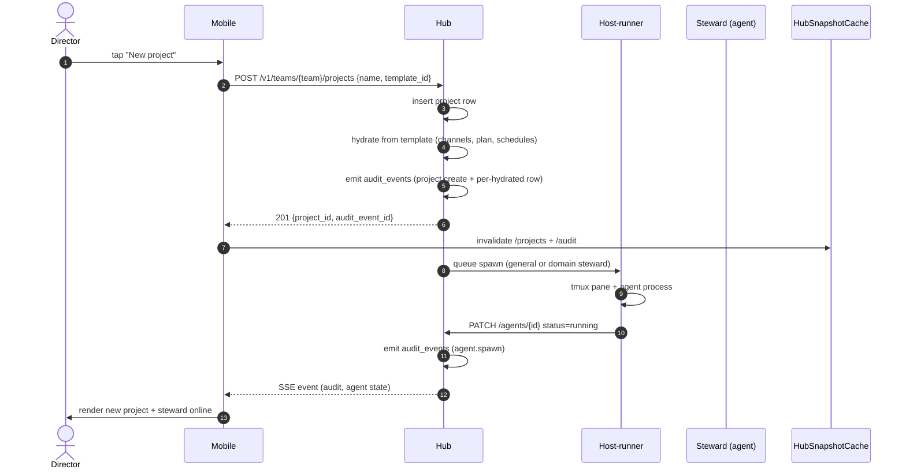
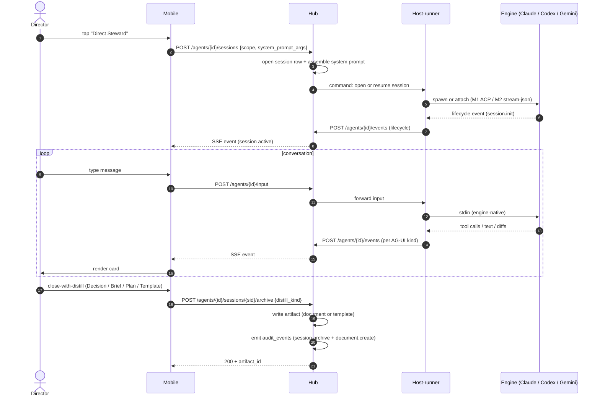
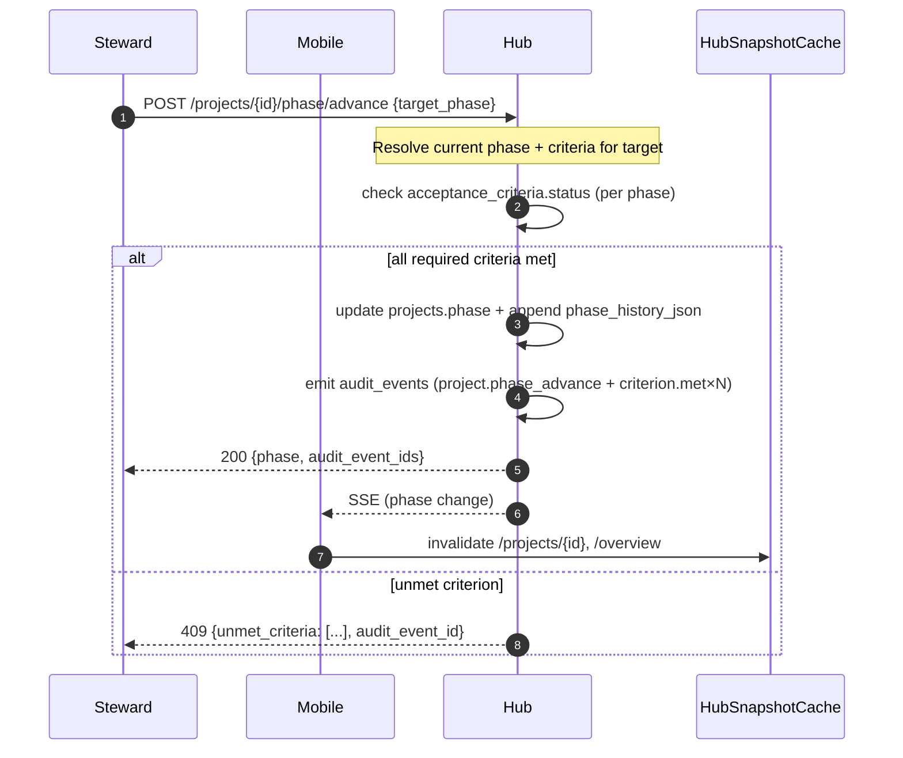
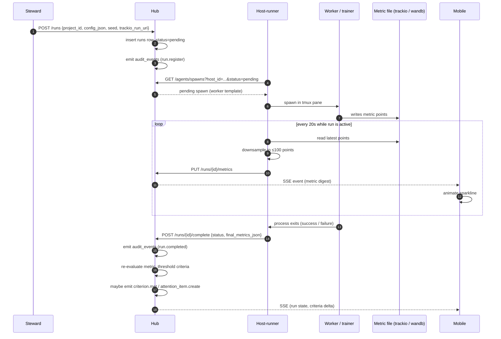
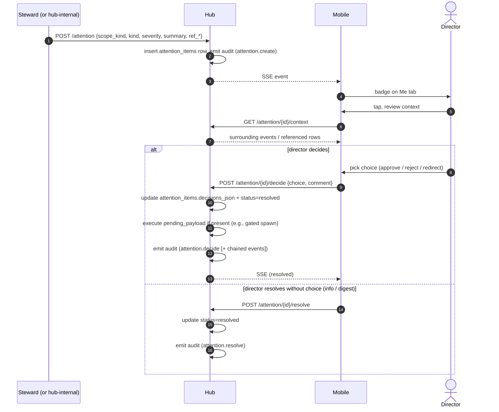
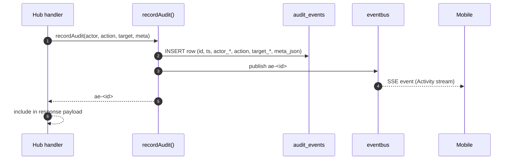
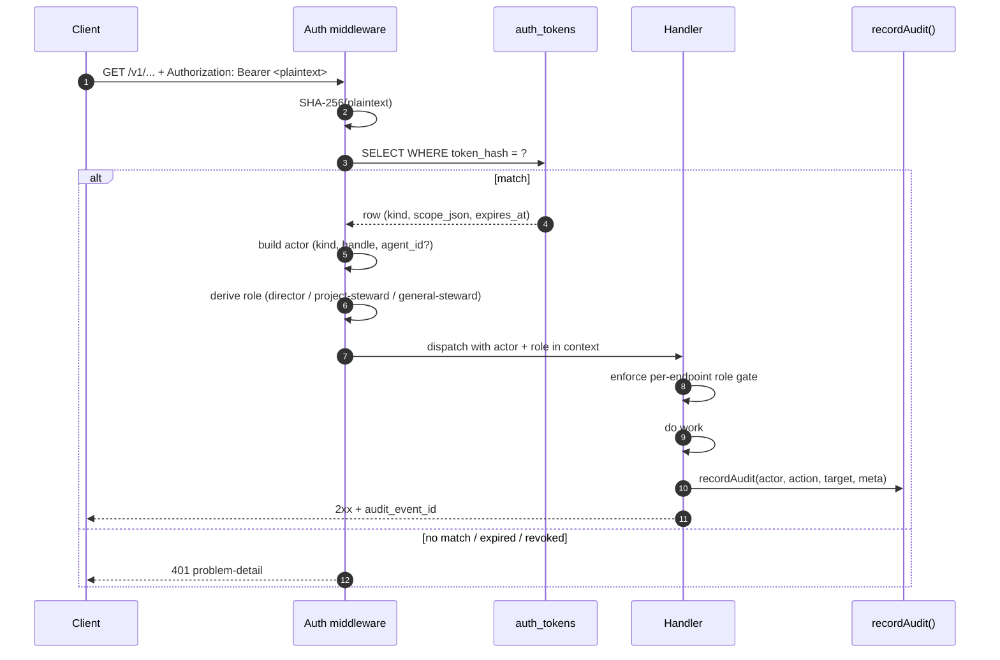
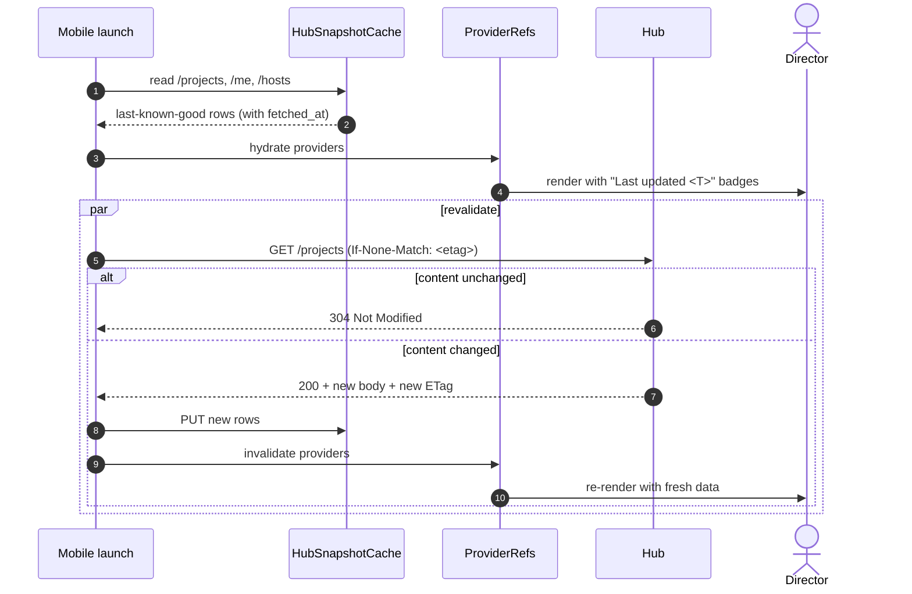

# System flows

> **Type:** axiom
> **Status:** Current (2026-05-05)
> **Audience:** contributors, reviewers
> **Last verified vs code:** v1.0.351

**TL;DR.** Sequence diagrams for the 8 critical cross-component flows.
Each diagram shows who-talks-to-whom, in what order, with what payload,
and where audit / cache effects land. Prose narrative for each flow
lives in its sister doc; the diagrams here complement, not replace.

This is arc42 §6 (Runtime View). Containers + protocols are at
[`../reference/architecture-overview.md`](../reference/architecture-overview.md);
data shapes at
[`../reference/database-schema.md`](../reference/database-schema.md);
endpoints at
[`../reference/api-overview.md`](../reference/api-overview.md).

---

## 1. Flow index

| # | Flow | Sister doc with prose |
|---|---|---|
| 1 | Project creation | [`blueprint.md §6.1`](blueprint.md), [`hub-api-deliverables.md`](../reference/hub-api-deliverables.md) |
| 2 | Session lifecycle | [`sessions.md`](sessions.md) |
| 3 | Phase advance | [`../reference/project-phase-schema.md`](../reference/project-phase-schema.md) |
| 4 | Run lifecycle | [`blueprint.md §6.5`](blueprint.md) |
| 5 | Attention item | [`../reference/attention-delivery-surfaces.md`](../reference/attention-delivery-surfaces.md) |
| 6 | Audit event emission | [`../reference/audit-events.md`](../reference/audit-events.md) |
| 7 | Auth + token resolution | [`../reference/permission-model.md`](../reference/permission-model.md), [`../reference/api-overview.md §2`](../reference/api-overview.md) |
| 8 | Cache-first cold start | [`../decisions/006-cache-first-cold-start.md`](../decisions/006-cache-first-cold-start.md) |

---

## 2. Flow 1 — Project creation

A director taps "New project" → mobile POSTs `/projects` → hub creates
the row + spawns a steward + audits the action → mobile cache
invalidates and re-renders.

Audit chain: `project.create` → `channel.create` (×N) →
`schedule.create` (×N) → `agent.spawn`.

---

## 3. Flow 2 — Session lifecycle

Director taps "Direct Steward" → mobile opens a session via the hub
→ host-runner spawns or resumes the engine → AG-UI events stream back
→ director input loops → close-with-distill writes the artifact.

Replace-keeps-session (v1.0.281+): if the engine process crashes mid-
conversation, the host-runner re-attaches with the same `engine_session_id`
([ADR-014](../decisions/014-claude-code-resume-cursor.md)) and replays
the transcript so far; the same session id continues.

---

## 4. Flow 3 — Phase advance

A steward (or director) advances the project phase → hub checks
acceptance criteria → either advances + audits or returns 409 with the
unmet criteria → mobile cache invalidates.

When the steward auto-marks a criterion (e.g., `metric_threshold`)
the same chain emits `criterion.met` ahead of `project.phase_advance`.
A ratify-prompt attention item may be created (Flow 5) for any
human-gated criteria still outstanding.

---

## 5. Flow 4 — Run lifecycle

Steward registers a run (frozen config + seed + trackio URI) → host-
runner's poller sees it and spawns a worker / mock-trainer → metrics
file accumulates points → host-runner digests + PUTs to the hub →
mobile sparkline animates → run completes + criteria re-evaluate.

Audit chain for a successful run: `run.register` →
(many `metric.digest` if instrumented) → `run.completed` →
optionally `criterion.met` / `attention.create`.

---

## 6. Flow 5 — Attention item

A blocker is created (decision needed, approval gated, idle agent,
metric ratify) → SSE pushes to mobile → director acts on Me tab →
resolution audited.

For the `permission_prompt` kind (turn-based delivery per
[ADR-011](../decisions/011-turn-based-attention-delivery.md)), the
agent stays in `waiting_attention` state until the director answers;
reaching the agent is via `Resume` / `Retry` after resolution.

---

## 7. Flow 6 — Audit event emission

Every mutation funnels through `recordAudit()` → `audit_events` row +
SSE fan-out + Activity tab feed.

Every handler that mutates state calls `recordAudit()` synchronously
*after* the mutation succeeds; the response includes the
`audit_event_id`. See [`../reference/audit-events.md`](../reference/audit-events.md)
for the action taxonomy and `meta_json` shape per action.

---

## 8. Flow 7 — Auth + token resolution

Each authenticated request is dispatched through middleware that
resolves bearer → token row → actor → role → handler.

For host-tokens, the host-runner reuses a single token across all
agents on its host; the agent identity is stamped on relayed MCP
calls inside the host-runner's gateway (not by the hub). The audit
row records both the relayed agent's identity and the host-runner's
host id in `meta_json`.

---

## 9. Flow 8 — Cache-first cold start

Mobile launch path: read cache → render → revalidate over network →
apply diff. Per [ADR-006](../decisions/006-cache-first-cold-start.md).

The "Last updated" badge stays visible until the revalidation lands.
On revalidate failure (hub unreachable), the cache stays served and
the banner switches to "Hub offline" — no spinner, no blocking
behaviour.

---

## 10. Cross-cutting timing notes

| Concern | Convention |
|---|---|
| Heartbeat (host-runner → hub) | 10 s |
| Spawn poll (host-runner → hub) | 3 s |
| Metric digest poll (host-runner → trackio file) | 20 s |
| SSE server-side buffer | ≥ 30 s for `Last-Event-ID` resume |
| Mobile revalidation concurrency cap | 6 in-flight per hub |
| Idempotency-Key TTL | 24 h |
| Audit emission ordering | synchronous after mutation, before response |

Retries use exponential backoff (1s → 30s, capped). Mobile mutations
always carry an Idempotency-Key. Host-runner POSTs always do.

---

## 11. Cross-references

- [`blueprint.md`](blueprint.md) — axioms, ontology, protocol layering
- [`agent-lifecycle.md`](agent-lifecycle.md) — per-agent state
- [`sessions.md`](sessions.md) — session ontology and lifecycle (Flow 2)
- [`information-architecture.md`](information-architecture.md) —
  surface architecture
- [`../reference/architecture-overview.md`](../reference/architecture-overview.md)
  — C4 view
- [`../reference/database-schema.md`](../reference/database-schema.md)
  — physical schema
- [`../reference/api-overview.md`](../reference/api-overview.md) —
  endpoint index
- [`../reference/audit-events.md`](../reference/audit-events.md) —
  audit row shape (Flow 6)
- [`../reference/attention-delivery-surfaces.md`](../reference/attention-delivery-surfaces.md)
  — attention surfaces (Flow 5)
- [`../reference/permission-model.md`](../reference/permission-model.md)
  — actor + scope (Flow 7)
- [`../decisions/006-cache-first-cold-start.md`](../decisions/006-cache-first-cold-start.md)
  — cache rationale (Flow 8)
